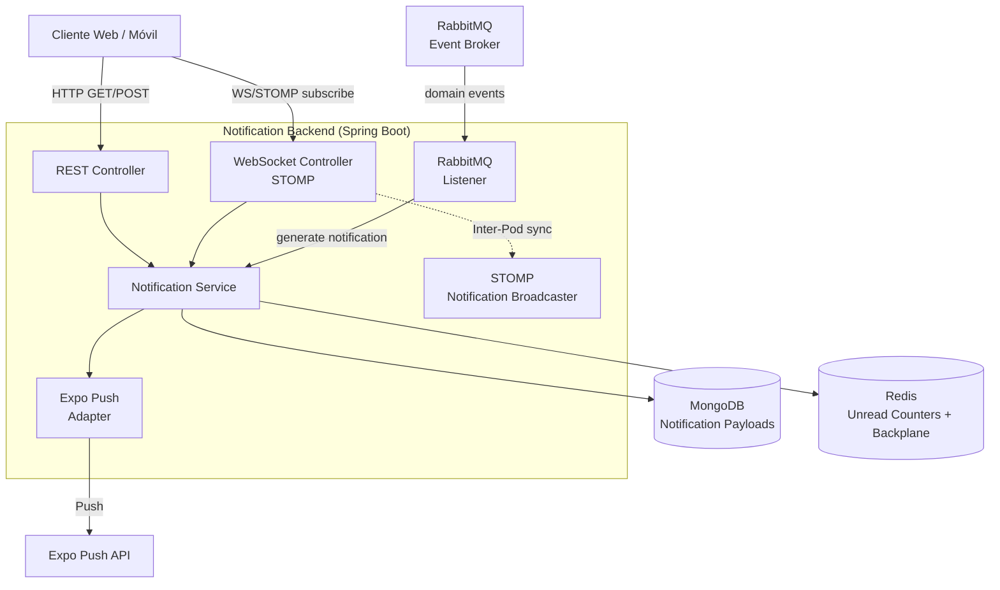
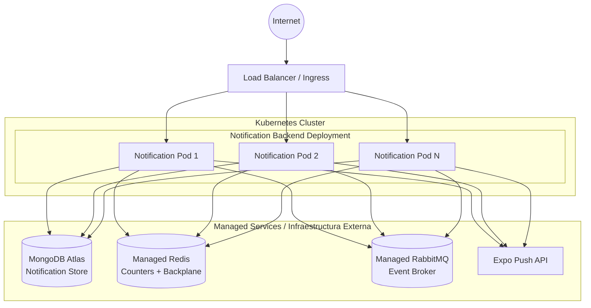

# Notification Backend Microservice

Este microservicio es responsable de gestionar y entregar notificaciones a los usuarios de la plataforma U-Link. Soporta notificaciones push (Expo Push para React Native), notificaciones in-app con contadores de no leídas, y notificaciones globales y por usuario. Escucha eventos de dominio de otros microservicios para generar notificaciones automáticas. Forma parte del ecosistema **PATRICIA**.

## ¿Qué hace el microservicio?

1. **Notificaciones Push (Expo Push):** Envía notificaciones push a dispositivos móviles a través de la API de Expo Push (React Native), permitiendo notificar a usuarios incluso cuando no están usando la aplicación.
2. **Notificaciones In-App con Contadores:** Proporciona un feed de notificaciones in-app con contadores de no leídas almacenados en Redis para acceso rápido. Los usuarios pueden marcar notificaciones como leídas individual o colectivamente.
3. **Sincronización Multi-nodo (Backplane):** Implementa un patrón de *Backplane* usando Redis Pub/Sub para sincronizar notificaciones en tiempo real entre múltiples instancias del servicio vía WebSockets (STOMP).
4. **Notificaciones Globales y Por Usuario:** Soporta notificaciones dirigidas a todos los usuarios (globales) y notificaciones personalizadas para usuarios específicos.
5. **Integración Orientada a Eventos:** Escucha eventos de dominio a través de RabbitMQ (AMQP) de otros microservicios (parches, eventos, comunicación) para generar notificaciones contextuales automáticamente.

---

## Parámetros de Calidad y Principios de Diseño

* **Arquitectura Hexagonal (Puertos y Adaptadores):** El dominio está desacoplado de la infraestructura mediante puertos y adaptadores. El envío de Expo Push está implementado como un adaptador (`ExpoPushAdapter`).
* **Principios SOLID:**
  * *Single Responsibility Principle (SRP):* Separación clara entre controladores REST (`NotificationController`), WebSockets (`StompNotificationBroadcaster`), lógica de negocio (`NotificationService`), y adaptadores (`ExpoPushAdapter`).
  * *Dependency Inversion Principle (DIP):* Inyección de dependencias a través de constructores inyectados.
* **Alta Disponibilidad y Escalabilidad Horizontal:** MongoDB almacena payloads de notificaciones, Redis maneja contadores de no leídas y backplane, permitiendo escalabilidad horizontal.
* **Tolerancia a Fallos:** *Health Probes* (liveness, readiness) a través de Spring Boot Actuator.
* **Testing y Code Coverage:** *Coverage Gate* con JaCoCo (mínimo 80% en líneas).

---

## Diagrama de Arquitectura



---

## Diagrama de Despliegue



## Tecnologías Principales

* Java 21
* Spring Boot 3.5.16
* Spring Web, Spring WebSockets
* Spring Data MongoDB
* Spring Data Redis (Counters + Backplane)
* Spring AMQP (RabbitMQ)
* Spring Boot Actuator
* Spring Validation
* Springdoc OpenAPI 2.8.16
* Expo Push API (React Native)
* JaCoCo (Coverage)

## API Documentation

The service exposes a RESTful API documented via OpenAPI. Once the application is running, you can explore the API using the Swagger UI available at:
```
http://<HOST>:<PORT>/swagger-ui.html
```
The OpenAPI specification is generated automatically by Springdoc and can be accessed at `/v3/api-docs`.

## Running Locally

### Prerequisites
- Java 21 (or newer)
- Maven 3.9+
- Docker (optional, for containerized execution)
- Access to a MongoDB instance (local or remote)
- Access to a Redis instance (local or remote)
- Access to a RabbitMQ broker (local or remote)

### Steps
1. Clone the repository and navigate to the project root.
2. Set the required environment variables (see *Configuration* section below).
3. Build the project:
   ```
   ./mvnw clean package
   ```
4. Run the application:
   ```
   java -jar target/notification-0.0.1-SNAPSHOT.jar
   ```
   The service will start on port **8091** by default.

## Docker Deployment

A Dockerfile is provided for containerizing the microservice. Build and run the image with:
```bash
docker build -t notification-backend:latest .

docker run -d \
  -p 8091:8091 \
  -e "SPRING_PROFILES_ACTIVE=prod" \
  -e "SPRING_DATA_MONGODB_URI=mongodb://mongo:27017/notifications" \
  -e "SPRING_REDIS_HOST=redis" \
  -e "SPRING_RABBITMQ_HOST=rabbitmq" \
  -e "EXPO_ACCESS_TOKEN=your-expo-token" \
  notification-backend:latest
```

A `docker-compose.yml` is also provided for local development with MongoDB, Redis, and RabbitMQ:
```bash
docker-compose up -d
```

## Configuration

The service requires the following environment variables:

| Variable | Description | Required |
|----------|-------------|----------|
| `JWT_SECRET` | Secret key for JWT validation | Yes |
| `SPRING_DATA_MONGODB_URI` | MongoDB connection URI | Yes |
| `SPRING_REDIS_HOST` | Redis host for counters and backplane | Yes |
| `SPRING_RABBITMQ_HOST` | RabbitMQ host for domain events | Yes |
| `SPRING_RABBITMQ_USERNAME` | RabbitMQ username | Yes |
| `SPRING_RABBITMQ_PASSWORD` | RabbitMQ password | Yes |
| `EXPO_ACCESS_TOKEN` | Expo Push API access token | Yes |
| `BACKPLANE_ENABLED` | Enable Redis backplane for multi-pod sync | No (default: false) |
| `REDIS_SSL_ENABLED` | Enable SSL for Redis connections (prod) | No (default: false) |
| `NOTIFICATION_RETENTION_DAYS` | Days to keep notifications (default: 90) | No |
| `FEED_PAGE_LIMIT` | Max notifications per page (default: 30) | No |

## Testing

Unit and integration tests are located under `src/test/java`. Run the full test suite with:
```bash
./mvnw verify
```
Coverage is enforced by JaCoCo with a minimum of **80%** line coverage.

## Contributing

Contributions are welcome! Please follow these steps:
1. Fork the repository.
2. Create a feature branch (`git checkout -b feature/awesome-feature`).
3. Implement your changes, ensuring existing tests pass and adding new tests if needed.
4. Submit a Pull Request with a clear description of the changes.

All contributions must adhere to the project's coding standards and pass the CI pipeline.

## License

This project is licensed under the **Apache License 2.0**. See the `LICENSE` file for details.
